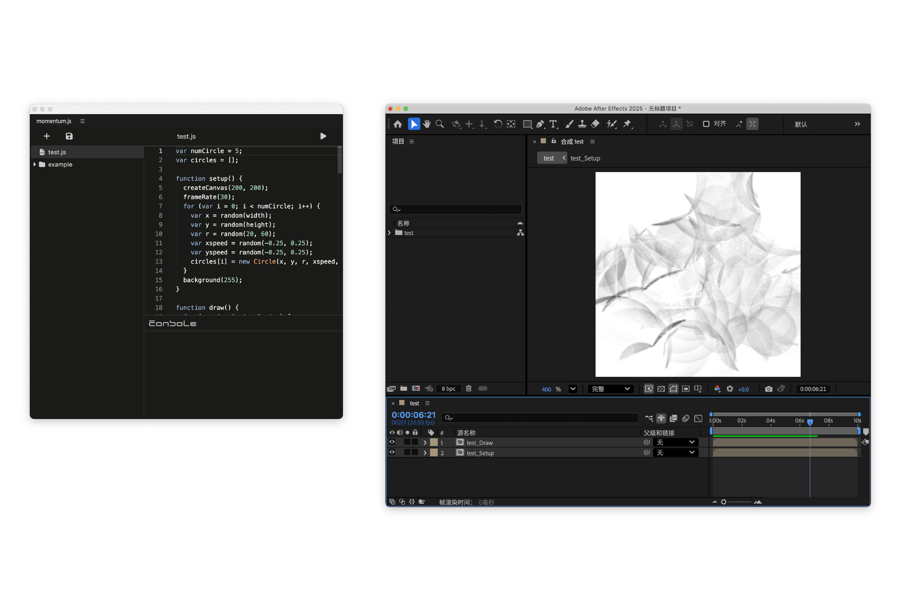

# momentum.js

<p align="center">
  
</p>

## Project Overview

`momentum.js` is an attempt to port the spirit of [Processing](https://processing.org/), [p5.js](https://p5js.org/), [openFrameworks](https://openframeworks.cc/), and [basil.js](https://basiljs2.netlify.app/) to Adobe After Effects. It aims to provide designers and developers with a powerful toolkit for procedural design and automation tasks within a user-friendly [WYSIWYG](https://en.wikipedia.org/wiki/WYSIWYG) interface in After Effects.



## Documentation

Start here if you are new to Momentum:

- [Getting Started](docs/getting-started.md)

Browse the full API reference here:

- [API Reference](docs/api/index.md)

## Features

### For Processing and p5.js users

- Bring the spirit of Processing and p5.js into After Effects, pairing code-driven generative art with a user-friendly environment for creating offline-rendered generative art videos.
- Drive generative systems directly from the AE timeline, with controller interfaces that let you animate sketch variables through keyframes.

### For After Effects users

- Extend the native motion graphics workflow with a programmable system for building procedural and generative compositions inside AE, then integrate the results directly into conventional animation comps.
- Overcome the limits of AE's fragmented tool model by connecting logic across expressions, scripts, plugins, and layers without relying on brittle index-based setups.


## Install

#### Requirements

- Adobe After Effects installed on the machine

#### macOS

Run:

```bash
curl -L https://github.com/barium3/momentumjs/releases/latest/download/momentumjs-installer.pkg -o momentumjs-installer.pkg
open momentumjs-installer.pkg
```

Or manually download: [latest release](https://github.com/barium3/momentumjs/releases/latest) / `momentumjs-installer.pkg`

Then restart After Effects.


#### Windows

Windows currently supports the CEP panel and `Vector` mode installation path only. `Bitmap` mode is not currently supported on Windows.

1. Download and unzip the release package.
2. Copy the unpacked `momentumjs` folder into:

```text
C:\Users\YourUsername\AppData\Roaming\Adobe\CEP\extensions\momentumjs
```

3. Restart After Effects.

### Uninstall

#### macOS

```bash
sudo rm -rf "$HOME/Library/Application Support/Adobe/CEP/extensions/momentumjs"
sudo find "$HOME/Library/Application Support/Adobe/Common/Plug-ins" -maxdepth 2 -type d -name MediaCore -exec rm -rf "{}/Momentum" \;
```

#### Windows

Remove:

```text
C:\Users\YourUsername\AppData\Roaming\Adobe\CEP\extensions\momentumjs
```

## Open in After Effects

- After installation, open the Momentum panel in After Effects from `Window > Extensions > momentum.js`
- Before using `Bitmap` mode, enable GPU acceleration in `File > Project Settings > Video Rendering and Effects > Use > Mercury GPU Acceleration`. This is the preparation step for Bitmap GPU rendering.

## Runtime Modes

Momentum currently has two runtime modes:

- `Vector`
  Sketch output is converted into native AE vector shapes, text objects, image layers, and controller layers.
- `Bitmap`
  Sketch output is rendered by the native `Momentum.plugin` effect, which unlocks a more complete API surface, GPU rendering, and larger renderable object counts.

Use `Vector` when you want AE-native vector graphics and text objects that remain easy to adjust after generation.

Use `Bitmap` when you need fuller rendering APIs such as `createGraphics()`, `loadPixels()`, `updatePixels()`, `filter()`, `blend()`, `loadFont()`, or `Font.textToPoints()`, and when you want the plugin's GPU-backed rendering path.

Bitmap mode is currently much more mature on macOS. Windows bitmap compatibility is still weaker.

## Contribution

Contributors are welcome to submit issues, feature requests, and code improvements.

Please read our contribution guidelines for more information:

- [Contributor Guide](docs/contributor.md)

## License

This project is licensed under the MIT License. See [LICENSE](LICENSE) for details.
