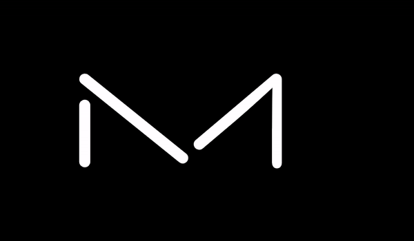
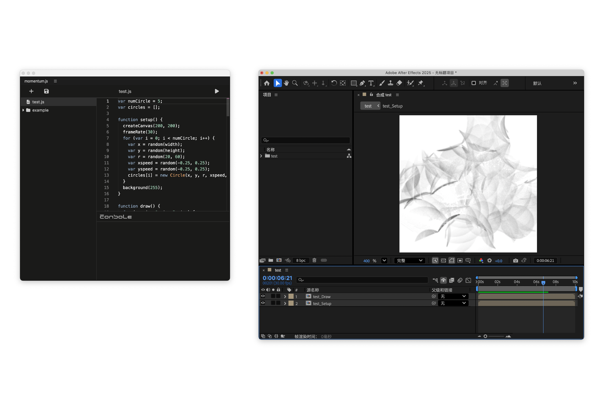

# momentum.js

<p align="center">
  
</p>

## Project Overview

`momentum.js` is an attempt to port the spirit of [Processing](https://processing.org/), [p5.js](https://p5js.org/), [openFrameworks](https://openframeworks.cc/), and [basil.js](https://basiljs2.netlify.app/) to Adobe After Effects. It aims to provide designers and developers with a powerful toolkit for procedural design and automation tasks within a user-friendly [WYSIWYG](https://en.wikipedia.org/wiki/WYSIWYG) interface in After Effects.



## Documentation

Start here if you are new to Momentum:

- [Getting Started](docs/getting-started.md)

Browse the full API reference here:

- [API Reference](docs/api/index.md)

## Features

### For Processing and p5.js users

- Bring the spirit of Processing and p5.js into After Effects, pairing code-driven generative art with a user-friendly environment for creating offline-rendered generative art videos.
- Drive generative systems directly from the AE timeline, with controller interfaces that let you animate sketch variables through keyframes.

### For After Effects users

- Extend the native motion graphics workflow with a programmable system for building procedural and generative compositions inside AE, then integrate the results directly into conventional animation comps.
- Overcome the limits of AE's fragmented tool model by connecting logic across expressions, scripts, plugins, and layers without relying on brittle index-based setups.


## Install

#### Requirements

- Adobe After Effects installed on the machine

#### macOS

Run:

```bash
curl -L https://github.com/barium3/momentumjs/releases/latest/download/momentumjs-installer.pkg -o momentumjs-installer.pkg
open momentumjs-installer.pkg
```

Or manually download: [latest release](https://github.com/barium3/momentumjs/releases/latest) / `momentumjs-installer.pkg`

Then restart After Effects.


#### Windows

Windows supports both `Vector` and `Bitmap` mode. Bitmap rendering follows the
GPU framework selected by After Effects: CUDA on compatible NVIDIA devices or
OpenCL when AE supplies an OpenCL context, with automatic CPU fallback. A
Windows release build installs the CEP panel and `Momentum.aex`; end users do
not need the CUDA toolkit.

For a source build, configure the AE SDK and vcpkg, then run:

```powershell
cmake --preset windows-vs2022
cmake --build --preset windows-release
powershell -ExecutionPolicy Bypass -File scripts/install-windows.ps1 `
  -Configuration Release -EnableCepDebugMode
```

The installer preserves the existing `user` workspace and installs the native
plugin under Adobe's shared `MediaCore\Momentum` directory. Restart After
Effects after installation.

### Uninstall

#### macOS

From an unpacked Momentum release or repository, run:

```bash
sh scripts/uninstall.sh
```

The uninstaller removes Momentum while preserving the CEP extension's `user/`
workspace. To remove the workspace too, run it with
`MOMENTUM_REMOVE_USER_DATA=1`.

#### Windows

Back up the extension's `user` folder, then remove:

```text
C:\Users\YourUsername\AppData\Roaming\Adobe\CEP\extensions\momentumjs
```

## Open in After Effects

- After installation, open the Momentum panel in After Effects from `Window > Extensions > momentum.js`
- Before using `Bitmap` mode, enable GPU acceleration in `File > Project Settings > Video Rendering and Effects > Use > Mercury GPU Acceleration`. This is the preparation step for Bitmap GPU rendering.

## Runtime Modes

Momentum currently has two runtime modes:

- `Vector`
  Sketch output is converted into native AE vector shapes, text objects, image layers, and controller layers.
- `Bitmap`
  Sketch output is rendered by the native `Momentum.plugin`/`Momentum.aex` effect, which unlocks a more complete API surface, platform GPU rendering where available, and larger renderable object counts.

Use `Vector` when you want AE-native vector graphics and text objects that remain easy to adjust after generation.

Use `Bitmap` when you need fuller rendering APIs such as `createGraphics()`, `loadPixels()`, `updatePixels()`, `filter()`, `blend()`, `loadFont()`, or `Font.textToPoints()`, and when you want the plugin's GPU-backed rendering path.

Bitmap mode uses Metal acceleration on macOS. On Windows it uses CUDA or
OpenCL when supplied by After Effects, with CPU fallback when GPU setup is not
available.

## Contribution

Contributors are welcome to submit issues, feature requests, and code improvements.

Please read our contribution guidelines for more information:

- [Contributor Guide](docs/contributor.md)

## License

This project is licensed under the MIT License. See [LICENSE](LICENSE) for details.
