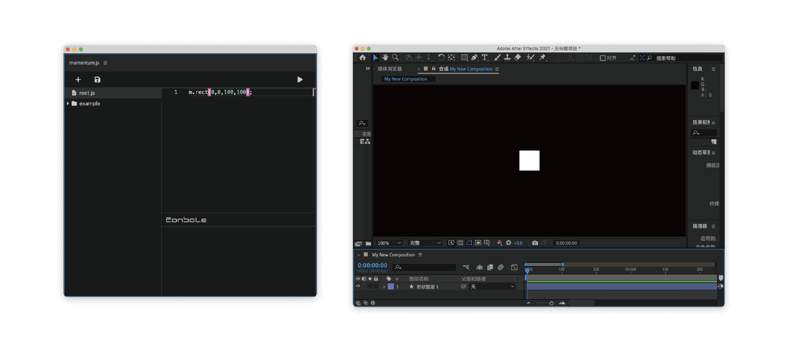

# momentum.js

## Project Overview

`momentum.js` is an attempt to port the spirit of the [Processing](https://processing.org/) framework (including [p5.js](https://p5js.org/)), [openFrameworks](https://openframeworks.cc/), and [basil.js](https://basiljs2.netlify.app/) to Adobe After Effects. It aims to provide designers and developers with a powerful toolkit for procedural design and automation tasks within a user-friendly [WYSIWYG](https://en.wikipedia.org/wiki/WYSIWYG) interface in After Effects.

## Installation Guide

### Windows

1. Download the latest version of `momentum.js`.
2. Extract the downloaded files.
3. Copy the extracted folder to the extensions directory of After Effects, typically located at `C:\Users\YourUsername\AppData\Roaming\Adobe\CEP\extensions`. If the folder doesn't exist, create it.
4. Restart Adobe After Effects.

### Mac

1. Download the latest version of `momentum.js`.
2. Extract the downloaded files.
3. Copy the extracted folder to the extensions directory of After Effects, typically located at `/Users/YourUsername/Library/Application Support/Adobe/CEP/extensions`. If the folder doesn't exist, create it.
4. Restart Adobe After Effects.

## Features

- Provides a programming interface similar to Processing and p5.js.
- Supports procedural graphics generation and automated design tasks.
- Seamless integration with After Effects.

## Example Code


I have developed an IDE in After Effects for writing momentum.js code. You can install it and try it out in After Effects.

```javascript
// Example code: Create a simple rectangle

m.rect(50, 50, 300, 300);
```

## Contribution

- Contributors are welcome to submit issues, feature requests, and code improvements.
- Please read our contribution guidelines before submitting.
